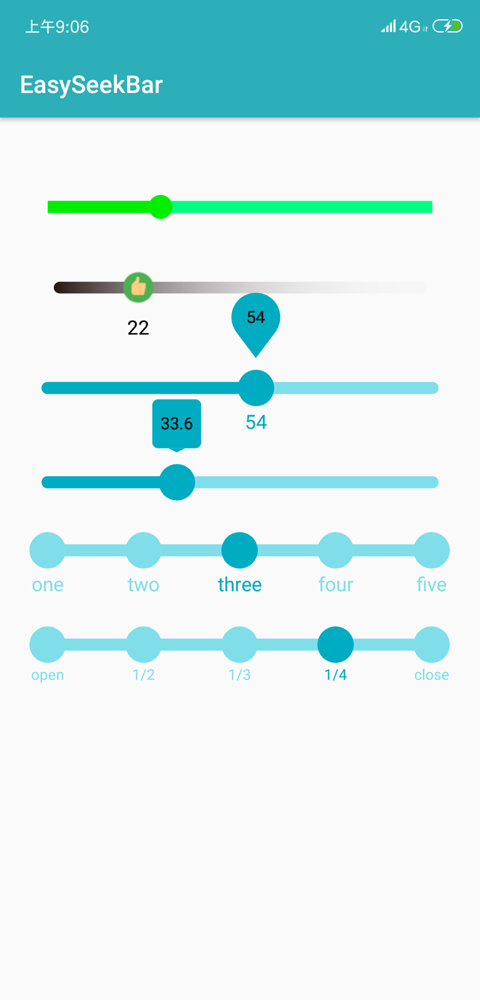

# EasySeekBar
This is a simple and easy to use progress bar that shows the indicator

#### 效果图示




#### 具体使用

> xml直接使用：

```xml
 <com.sheng.lib.EasySeekBar
     android:id="@+id/id_seekbar_normal"
     android:layout_width="match_parent"
     android:layout_height="wrap_content"/>
```


> xml属性参考：

| 属性名称                   | 属性值             | 属性解释                                                     |
| -------------------------- | ------------------ | ------------------------------------------------------------ |
| ssb_seekbarType            | progress / diy     | progress : 正常SeekBar模式    diy : 自定义文本模式           |
| ssb_bubbleType             | circle / roundRect | circle : 展示气泡形式为圆形   roundRect ： 展示气泡形式为矩形 |
| ssb_seekbarHeight          | dp或者资源值       | 设置SeekBar的进度条高度                                      |
| ssb_normalRadius           | dp或者资源值       | 设置thumb默认的大小                                          |
| ssb_selectRadius           | dp或者资源值       | 设置thumb点击后的大小                                        |
| ssb_spaceHeight            | dp或者资源值       | 设置Seekbar中间间隔边距                                      |
| ssb_seekbarImg             | 资源值             | 设置SeekBar的进度条图片                                      |
| ssb_thumbImg               | 资源值             | 设置SeekBar的thumb图片                                       |
| ssb_seekbarFirstColor      | 资源值             | 设置SeekBar背景颜色                                          |
| ssb_seekbarSecondColor     | 资源值             | progress模式下，设置SeekBar拖动的颜色                        |
| ssb_thumbColor             | 资源值             | 设置SeekBar的thumb颜色                                       |
| ssb_thumbSelectColor       | 资源值             | diy模式下，设置SeekBar选中的thumb颜色                        |
| ssb_seekbarTextSize        | 资源值             | 设置SeekBar底部文本的字体大小                                |
| ssb_seekbarTextColor       | 资源值             | 设置SeekBar底部文本的颜色                                    |
| ssb_seekbarTextSelectColor | 资源值             | diy模式下，设置SeekBar底部选中的文本颜色                     |
| ssb_bubbleRadius           | 资源值             | 设置气泡的大小                                               |
| ssb_seekbarBubbleColor     | 资源值             | 设置气泡背景颜色                                             |
| ssb_seekbarBubbleTextSize  | 资源值             | 设置气泡文本字体大小                                         |
| ssb_seekbarBubbleTextColor | 资源值             | 设置气泡文本颜色                                             |
| ssb_maxProgress            | int                | progress模式下的当前最大值                                   |
| ssb_minProgress            | int                | progress模式下的当前最小值                                   |
| ssb_progress               | int                | progress模式下的当前进度                                     |
| ssb_isSeekBarRound         | boolean            | 是否使得SeekBar两边使用圆角模式                              |
| ssb_isShowText             | boolean            | 是否使得SeekBar展示底部的文本                                |
| ssb_isShowFloat            | boolean            | 是否使得文本显示为带小数点类型                               |
| ssb_isShowBubble           | boolean            | 是否使得SeekBar显示气泡                                      |
| ssb_isAlwayShowBubble      | boolean            | 是否使得SeekBar一直显示气泡                                  |
| ssb_isCanTouch             | boolean            | 是否使得SeekBar可点击                                        |


