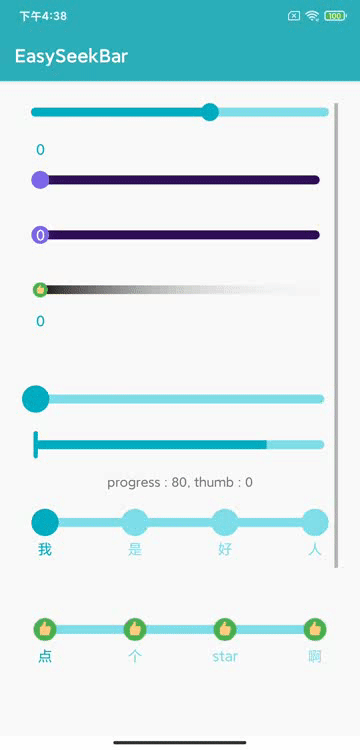
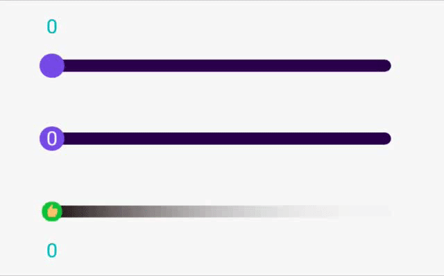
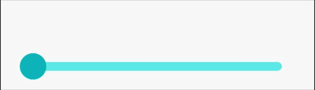
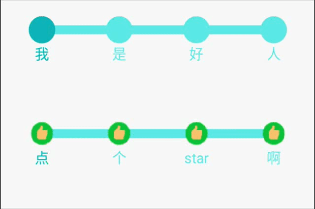
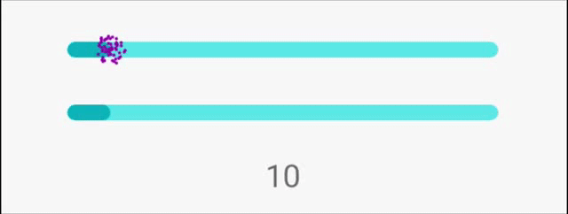
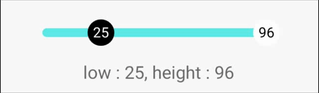

# EasySeekBar
一个简单方便，多功能的SeekBar，既拥有ProgressBar功能，也有SeekBar功能，并在其基础上新增多种变化

## 效果图示



## 具体使用

### 第一步：添加依赖

在工程根目录的build.gradle下新增：

```groovy
	allprojects {
		repositories {
			...
			maven { url 'https://jitpack.io' }
		}
	}
```
在app的build.gradle新增下：

 ```groovy
 	dependencies {
	        implementation 'com.github.shengMR:EasySeekBar:v1.0.11'
	}
 ```

### 第二步：布局文件中编写

+ 基本的SeekBar

  ```xml
   <com.sheng.lib.EasySeekBar
       android:layout_width="match_parent"
       android:layout_height="wrap_content"/>
  ```


+ 可设置颜色及文本显示的Seekbar

  | 属性                    | 属性值  | 功能                         |
  | ----------------------- | ------- | ---------------------------- |
  | ssb_bar_color           | color   | 设置背景底颜色               |
  | ssb_bar_progress_color  | color   | 设置进度颜色                 |
  | ssb_is_show_text        | boolean | 设置是否显示文本             |
  | ssb_text_show_type      | up      | 设置显示文本的位置在滑块上面 |
  |                         | down    | 设置显示文本的位置在滑块下面 |
  |                         | inner   | 设置显示文本的位置在滑块中心 |
  | ssb_thumb_color         | color   | 设置滑块颜色                 |
  | ssb_thumb_normal_radius | dp      | 设置滑块未按下时的半径       |
  | ssb_thumb_select_radius | dp      | 设置滑块按下时的半径         |

  ```xml
    <com.sheng.lib.EasySeekBar
              android:layout_width="match_parent"
              android:layout_height="wrap_content"
              android:layout_marginTop="20dp"
              app:ssb_bar_color="#300F56"
              app:ssb_bar_progress_color="#8068EA"
              app:ssb_is_show_text="true"
              app:ssb_text_show_type="up"
              app:ssb_thumb_color="#8068EA"
              app:ssb_thumb_normal_radius="10dp"
              app:ssb_thumb_select_radius="20dp" />
  
  
  ```

  




+ 可显示气泡的SeekBar

  | 属性                  | 属性值  | 功能               |
  | --------------------- | ------- | ------------------ |
  | ssb_is_show_bubble    | boolean | 设置是否显示气泡   |
  | ssb_bubble_radius     | dp      | 设置气泡的半径     |
  | ssb_bubble_color      | color   | 设置气泡的底色     |
  | ssb_bubble_text_color | color   | 设置气泡的文本颜色 |

  ```xml
  <com.sheng.lib.EasySeekBar
              android:id="@+id/id_seekbar_3"
              android:layout_width="match_parent"
              android:layout_height="wrap_content"
              android:layout_marginTop="60dp"
              app:ssb_bar_color="#80DEEA"
              app:ssb_bar_height="10dp"
              app:ssb_bar_progress_color="#00ACC1"
              app:ssb_bubble_color="#00ACC1"
              app:ssb_bubble_radius="20dp"
              app:ssb_bubble_text_color="#FFFFFF"
              app:ssb_is_can_touch="false"
              app:ssb_is_show_bubble="true"
              app:ssb_thumb_color="#00ACC1"
              app:ssb_thumb_normal_radius="15dp"
              app:ssb_thumb_select_radius="15dp" />
  ```

  




+ 滑块和进度分离的SeekBar

  | 属性                       | 属性值  | 功能                   |
  | -------------------------- | ------- | ---------------------- |
  | ssb_is_thumb_progress_part | boolean | 设置滑块与进度是否分开 |

  ```xml
  <com.sheng.lib.EasySeekBar
              android:id="@+id/id_seekbar_4"
              android:layout_width="match_parent"
              android:layout_height="wrap_content"
              android:layout_marginTop="20dp"
              app:ssb_bar_color="#80DEEA"
              app:ssb_bar_height="10dp"
              app:ssb_bar_progress_color="#00ACC1"
              app:ssb_is_thumb_progress_part="true"
              app:ssb_thumb_color="#00ACC1"
              app:ssb_thumb_height="30dp"
              app:ssb_thumb_normal_radius="15dp"
              app:ssb_thumb_select_radius="15dp"
              app:ssb_thumb_width="5dp" />
  ```

  


+ 带有节点的SeekBar

  | 属性         | 属性值      | 功能                        |
  | ------------ | ----------- | --------------------------- |
  | ssb_bar_type | seekbar     | 设置SeekBar类型为带滑块     |
  |              | Progress    | 设置SeekBar类型为只带进度   |
  |              | lowOrHeight | 设置SeekBar类型为带两个滑块 |
  |              | diy         | 设置SeekBar类型为带节点     |

  ```xml
  <com.sheng.lib.EasySeekBar
              android:id="@+id/id_seekbar_5"
              android:layout_width="match_parent"
              android:layout_height="wrap_content"
              android:layout_marginTop="20dp"
              android:padding="10dp"
              app:ssb_bar_color="#80DEEA"
              app:ssb_bar_height="10dp"
              app:ssb_bar_type="diy"
              app:ssb_is_show_text="true"
              app:ssb_text_color="#80DEEA"
              app:ssb_text_select_color="#00ACC1"
              app:ssb_thumb_color="#80DEEA"
              app:ssb_thumb_normal_radius="15dp"
              app:ssb_thumb_select_color="#00ACC1"
              app:ssb_thumb_select_radius="15dp" />
  ```

  需要代码设置显示数据

  ```java
  // 设置要显示的节点数据
  easySeekBar5.setItems("我", "是", "好", "人");
  easySeekBar5.setSeekBarDiyChangeListener(new EasySeekBar.OnSeekBarDiyChangeListener() {
  	@Override
  	public void onDiyChange(EasySeekBar easySeekBar, String text, int position) {
  		String format = String.format(Locale.getDefault(), "%s click by : %d", text, position);
  		textView5.setText(format);
  	}
  });
  ```

  




+ 普通的进度条，不带滑块

  | 属性                   | 属性值   | 功能                   |
  | ---------------------- | -------- | ---------------------- |
  | ssb_firework_color     | color    | 设置进度尾巴烟花的颜色 |
  | ssb_progress_show_type | firework | 设置进度尾巴为烟花喷射 |
  |                        | nothing  | 设置进度尾巴为默认     |

  ```xml
    <com.sheng.lib.EasySeekBar
              android:id="@+id/id_seekbar_7"
              android:layout_width="match_parent"
              android:layout_height="wrap_content"
              android:layout_marginTop="20dp"
              android:padding="10dp"
              app:ssb_bar_type="progress"
              app:ssb_firework_color="#9C27B0"
              app:ssb_is_open_animator="true"
              app:ssb_progress="50"
              app:ssb_progress_show_type="firework" />
  ```

  




+ 带两个滑块的SeekBar

  | 属性                           | 属性值  | 功能                                 |
  | ------------------------------ | ------- | ------------------------------------ |
  | ssb_text_color_for_height      | dp      | 设置右侧滑块的文本颜色               |
  | ssb_text_color_for_low         | dp      | 设置左侧滑块的文本颜色               |
  | ssb_thumb_height_color         | color   | 设置右侧滑块的颜色                   |
  | ssb_thumb_low_color            | color   | 设置左侧滑块的颜色                   |
  | ssb_is_thumb_no_over           | boolean | 设置两个滑块碰撞后是否越过           |
  | ssb_is_thumb_no_over_than_move |         | 设置两个滑块碰撞后越过后是否继续滑动 |

  ```xml
   <com.sheng.lib.EasySeekBar
              android:id="@+id/id_seekbar_8"
              android:layout_width="match_parent"
              android:layout_height="wrap_content"
              android:layout_marginTop="20dp"
              android:paddingLeft="10dp"
              android:paddingRight="10dp"
              app:ssb_bar_type="lowOrHeight"
              app:ssb_is_open_animator="true"
              app:ssb_is_show_text="true"
              app:ssb_text_color_for_height="#000000"
              app:ssb_text_color_for_low="#FFFFFF"
              app:ssb_text_show_type="inner"
              app:ssb_thumb_height_color="#FFFFFF"
              app:ssb_thumb_low_color="#000000"
              app:ssb_thumb_normal_radius="15dp"
              app:ssb_thumb_select_radius="15dp" />
  ```

  



> 不吝啬的请留下你们的StarStarStar嘻嘻嘻嘻


