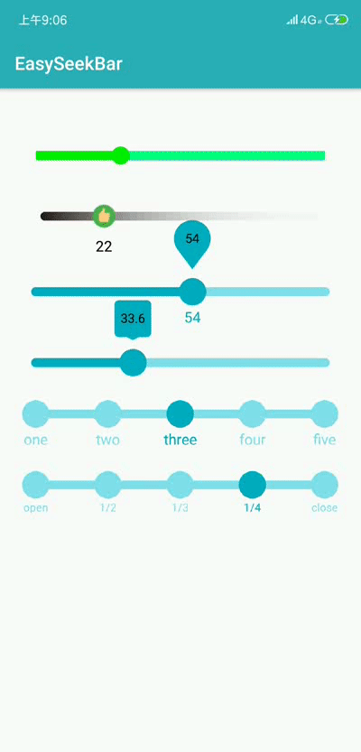

# EasySeekBar
This is a simple and easy to use progress bar that shows the indicator

#### 效果图示



#### 具体使用

> 添加依赖

```groovy
	allprojects {
		repositories {
			...
			maven { url 'https://jitpack.io' }
		}
	}
```
 ```groovy
 	dependencies {
	        implementation 'com.github.shengMR:EasySeekBar:v1.0.8'
	}

 ```

> xml直接使用：

```xml
 <com.sheng.lib.EasySeekBar
     android:id="@+id/id_seekbar_normal"
     android:layout_width="match_parent"
     android:layout_height="wrap_content"/>
```


